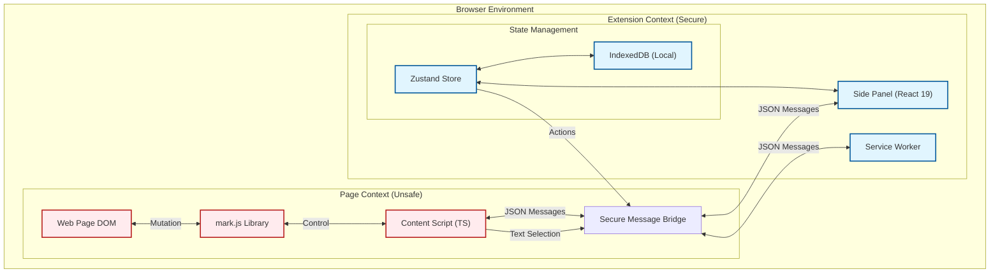

# Sci-Lighter (Alpha Preview)

**Sci-Lighter** is an experimental open-source browser extension designed to explore new ways of interacting with web content. It aims to bridge the gap between passive reading and active knowledge construction by providing tools for highlighting, annotation, and synthesis directly within the browser. It features cross-annotation linking across multiple sources, integrating AI-assisted summaries, comparisons, and insights. 

> [!WARNING]
> **Status: Experimental / Alpha**
> This project is currently in early development. It is **not production-ready**. Features may change, and bugs are expected. It serves as a proof-of-concept for a modern, React-based extension architecture using Manifest V3.

---

## Architecture & Design

WebMark Pro implements a **Hybrid Architecture** to balance the rich interactivity of modern web apps with the strict security constraints of Chrome Manifest V3.

### High-Level System Overview

The system is composed of two isolated contexts—the **Side Panel** (Extension Context) and the **Content Script** (Page Context)—communicating via a secure, type-safe Bridge.

### Key Components

1.  **Side Panel (The "Brain")**:
    *   Built with **React 19** and **Shadcn UI**.
    *   Hosts the entire application logic, state management (**Zustand**), and user interface.
    *   Runs in a secure, isolated extension context.

2.  **Content Script (The "Hands")**:
    *   Lightweight script injected into the web page.
    *   Responsible *only* for DOM manipulation (rendering highlights using `mark.js`) and capturing user events (text selection).
    *   Communicates strictly via JSON messages.

3.  **The Bridge**:
    *   A strongly-typed messaging layer that decouples the UI from the DOM.
    *   Prevents direct access to extension APIs from the web page.

---

## Security Approach

Security is a primary concern, especially for an extension that handles user data and interacts with arbitrary web pages.

### 1. Strict Content Security Policy (CSP)
We adhere to the strict **Manifest V3** CSP. 
*   **`script-src 'self'`**: No external scripts are loaded. All logic is bundled locally.
*   **`object-src 'none'`**: Flash and other plugins are disabled.

### 2. Message Sanitization & Validation
The **Bridge** acts as a firewall between the untrusted web page and the privileged extension context.
*   **Input Validation**: All messages from the Content Script are treated as untrusted. Payloads (like selected text) are treated as strings, never evaluated as code.
*   **XSS Mitigation**: We do not use `innerHTML` directly with user-provided content. When rendering text in the UI, React's standard escaping is used. On the page, `mark.js` handles DOM insertion safely.

### 3. Isolation
The Side Panel runs in its own process, isolated from the web page's JavaScript. Malicious scripts on a visited website cannot access the extension's `localStorage` or `IndexedDB` directly.

---

## Tech Stack

*   **Language**: TypeScript 5+ (Strict Mode)
*   **Frontend**: React 19, Tailwind CSS, Shadcn UI
*   **State**: Zustand (with Immer for immutability)
*   **Build Tool**: Vite (with CRXJS plugin for HMR)
*   **Testing**: Vitest (Unit & Integration)
*   **Linting**: ESLint + Prettier

---

## Known Limitations (Alpha)

*   **Persistence**: Currently uses local storage/IndexedDB. Cloud sync is a work-in-progress.
*   **PDF Support**: Not yet implemented. Works best on standard HTML articles.
*   **Mobile**: Not optimized for mobile browsers.

---

## Contributing

We welcome feedback and contributions to help mature this experimental project. Please see [CONTRIBUTING.md](./CONTRIBUTING.md) for guidelines.

1.  Clone the repository.
2.  Install dependencies: `pnpm install`
3.  Start dev server: `pnpm dev`
4.  Load distinct folder in Chrome Extensions (Developer Mode).

---
*Disclaimer: This is a personal research project. Use at your own risk.*
