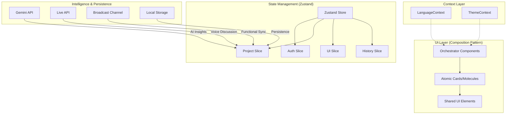

# WebMark Pro: The Pedagogical Knowledge Engine

WebMark Pro is a experimental intenbded to be a high-performance, browser-native **Personal Knowledge Management (PKM)** tool. The goal is transforms the web from a static canvas into a dynamic research laboratory, enabling anyone to annotate, sketch, and synthesize knowledge across disparate sources. If it reachs the point to be useful to researchers, mission cconplieshed.

---

## 🛡️ Security & Compliance (Defense in Depth)

This project adheres to international security standards to ensure the highest level of trustworthiness. We employ a **Positive Security Model** (Strict Whitelisting) rather than relying on blacklist-based filtering.

### Standards & Protocols
- **OWASP**: Compliant with [OWASP XSS Prevention Cheat Sheet](https://cheatsheetseries.owasp.org/cheatsheets/Cross_Site_Scripting_Prevention_Cheat_Sheet.html) (Rule #3: Sanitize with a dedicated library).
- **ISO 27001**: Implements "Defense in Depth" and "Least Privilege" principles.
- **Manifest V3**: Leverages the "Nuclear Option" of browser-enforced strict Content Security Policy (CSP).

### Layered Defense Architecture
1.  **Strict Sanitization (Layer 1)**:
    -   All HTML content is sanitized via `DOMPurify` using a **Strict Whitelist**.
    -   Only safe semantic tags (`p`, `h1`, `mark`, etc.) are allowed.
    -   Dangerous vectors (`<script>`, `<iframe>`, `object`, `onclick`) are explicitly destroyed before rendering.

2.  **Browser CSP (Layer 2)**:
    -   Adheres to Chrome's strict Manifest V3 `content_security_policy`.
    -   `script-src 'self'`: Prevents execution of *any* inline script or unapproved external source, rendering XSS attacks inert availability.

---

## 🏗 System Architecture

The application is built on a **Modular Slice Architecture** with a high-performance **Component Composition Pattern**.

## 🧠 Core Pedagogical Features

### 1. The Modular Workbench
A dedicated staging area to bridge insights across different websites. Users can link disparate highlights and write "Synapses"—original conclusions that form your personal knowledge graph.

### 2. Pro Theme Engine & Localization
- **Adaptive UI**: Switch between Light and Dark modes with a single click. The entire UI is built on CSS variables that update dynamically.
- **Full i18n**: Support for English and Portuguese (PT-BR), ensuring researchers can work in their native tongue.

### 3. Smart Sidebars
Context-aware sidebars that filter, sort, and search your research history. Extracted card components ensure a responsive, high-fidelity UI that scales with thousands of highlights.

### 4. Deep-Link Teleportation
Using the **Chrome Text Fragment API**, the app generates non-brittle deep links. Jump from a summary directly to the exact paragraph on the original source page.

### 5. AI-Powered Discussion
Integrates the **Gemini Live API** for real-time voice conversations about your research. Challenge your own synthesis with AI-driven dialectic.

## 🛠 Tech Stack

- **Core**: React 19 (ESM), TypeScript.
- **State**: Zustand (Slice Pattern) with Functional Updates.
- **Styling**: Tailwind CSS + CSS Variables (Custom Variable-First approach).
- **Graphics**: HTML5 Canvas (Quadratic Curve smoothing).
- **Communication**: BroadcastChannel API for multi-tab synchronization.

---

For development guidelines, see [CONTRIBUTING.md](./CONTRIBUTING.md).
